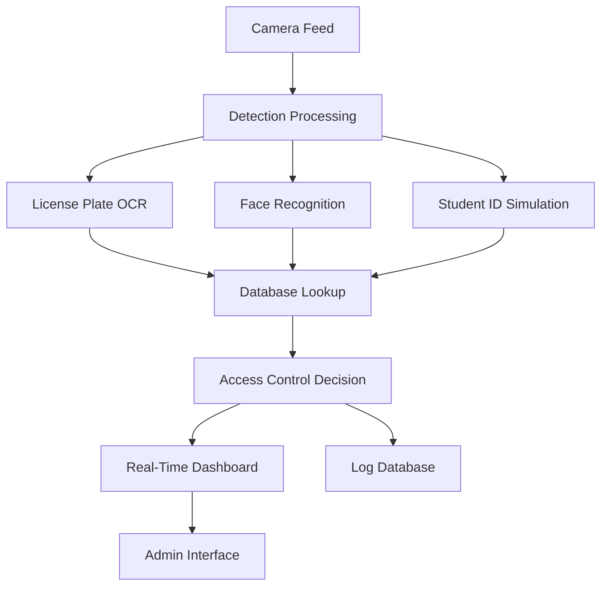

# Campus Sentinel Flow - Multi-Modal Security System

[](https://opensource.org/licenses/MIT)
[](https://www.python.org/downloads/)
[](https://reactjs.org/)

A comprehensive campus security system integrating **license plate detection**, **facial recognition**, and **student ID scanning** with real-time monitoring dashboard.

## 🌟 Features

### Multi-Modal Detection
- 🚗 **License Plate Recognition** - OpenALPR integration with image enhancement
- 👤 **Facial Recognition** - OpenCV-based face detection with trained classifiers
- 📱 **Student ID Scanning** - Barcode/QR code simulation for access control

### Real-Time Monitoring
- 📊 **Live Dashboard** - React-based admin interface
- 🔄 **Real-Time Updates** - Socket.IO for instant notifications
- 📋 **Access Logs** - Comprehensive audit trail
- 📷 **Live Camera Feed** - Streaming video with detection overlays

### Security Features
- 🔒 **Authorized Access Control** - Student database integration
- ⚠️ **Unrecognized Detection** - Alerts for unauthorized individuals
- 📈 **Detection Statistics** - Performance monitoring and analytics

## 🏗️ System Architecture



## 🚀 Quick Start

### Prerequisites
- Python 3.8+
- Node.js 16+
- OpenCV 4.x
- OpenALPR 2.3+
- Camera/Webcam

### Installation

1. **Clone the repository**
   ```bash
   git clone https://github.com/Em001hub/hnov.git
   cd hnov
   ```

2. **Backend Setup**
   ```bash
   cd campus-sentinel-flow-main/backend
   python -m venv venv
   venv\Scripts\activate  # Windows
   # source venv/bin/activate  # Linux/Mac
   pip install -r requirements.txt
   ```

3. **Frontend Setup**
   ```bash
   cd campus-sentinel-flow-main
   npm install
   ```

4. **Database Initialization**
   ```bash
   python quick_setup.py
   ```

### 🏃‍♂️ Running the Application

#### Option 1: Using Startup Script (Recommended)
```bash
cd campus-sentinel-flow-main
start_campus_sentinel.bat  # Windows
```

#### Option 2: Manual Start
```bash
# Terminal 1 - Backend
cd campus-sentinel-flow-main/backend
python app.py

# Terminal 2 - Frontend  
cd campus-sentinel-flow-main
npm run dev
```

### 📱 Access the Application
- **Frontend Dashboard**: http://localhost:5173
- **Security Monitoring**: http://localhost:5173/monitoring
- **Backend API**: http://localhost:5000

## 🔧 Configuration

### OpenALPR Setup
- Ensure OpenALPR is installed in `openalpr_64/` directory
- Configuration file: `openalpr_64/openalpr.conf`
- Supported regions: US, EU

### Face Recognition Setup
- Place training images in respective directories
- Classifiers stored in `FaceRecognition-GUI-APP-master/data/classifiers/`
- Supported formats: XML classifiers

### Database Configuration
- SQLite database: `campus_sentinel.db`
- Tables: students, license_plates, access_logs
- Sample data automatically populated

## 📋 API Endpoints

### Camera Control
- `POST /api/start_camera` - Start camera feed
- `POST /api/stop_camera` - Stop camera feed
- `POST /api/toggle_detection` - Toggle detection mode

### Data Management
- `GET /api/access_logs` - Retrieve access logs
- `GET /api/students` - Get student database
- `POST /api/student_scan` - Manual student ID scan

### System Status
- `GET /api/camera_status` - Camera status
- `GET /api/detection_stats` - Detection statistics

## 🎯 Usage Guide

### Starting Detection
1. Open the monitoring dashboard
2. Click **"Start Camera"**
3. Click **"Start Detection"** 
4. System will begin multi-modal detection

### Detection Modes
- **License Plates**: Show vehicle plates to camera
- **Face Recognition**: Authorized faces (Mihika Patil, Vinayak Kundar)
- **Student ID**: Automatic simulation running

### Monitoring
- Real-time alerts appear on dashboard
- Access logs updated automatically
- Detection statistics tracked continuously

## 🔍 System Components

### Backend (`backend/app.py`)
- Flask web server with Socket.IO
- Multi-threaded camera processing
- OpenALPR integration
- SQLite database management
- Real-time event broadcasting

### Frontend (`src/`)
- React with TypeScript
- Real-time dashboard components
- Camera feed streaming
- Socket.IO client integration

### Detection Modules
- **License Plate**: OpenALPR with image enhancement
- **Face Recognition**: OpenCV LBPH classifiers
- **Student ID**: Simulation-based scanning

## 📊 Database Schema

### Students Table
```sql
CREATE TABLE students (
    id INTEGER PRIMARY KEY,
    student_id TEXT UNIQUE,
    name TEXT,
    email TEXT,
    face_trained BOOLEAN,
    active BOOLEAN
);
```

### Access Logs Table
```sql
CREATE TABLE access_logs (
    id INTEGER PRIMARY KEY,
    timestamp TIMESTAMP,
    detection_type TEXT,
    detected_value TEXT,
    student_id TEXT,
    student_name TEXT,
    status TEXT,
    confidence REAL
);
```

## 🧪 Testing

### License Plate Detection
```bash
python test_license_plate.py
```

### Face Recognition
```bash
python test_face_now.py
```

### System Integration
```bash
python quick_test_scans.py
```

## 🔧 Troubleshooting

### Common Issues

1. **Camera Not Starting**
   - Check camera permissions
   - Ensure no other apps using camera
   - Try different camera indices

2. **License Plate Not Detected**
   - Ensure good lighting
   - Hold plate clearly in view
   - Check OpenALPR installation

3. **Face Recognition Issues**
   - Verify classifier files exist
   - Check lighting conditions
   - Ensure face is clearly visible

### Debug Mode
Enable detailed logging by setting detection intervals and checking console output.

## 📁 Project Structure

```
hnov/
├── campus-sentinel-flow-main/           # Main application
│   ├── backend/                         # Flask backend
│   │   ├── app.py                      # Main application
│   │   ├── requirements.txt            # Python dependencies
│   │   └── venv/                       # Virtual environment
│   ├── src/                            # React frontend
│   │   ├── components/                 # UI components
│   │   ├── pages/                      # Page components
│   │   └── ...
│   ├── package.json                    # Node.js dependencies
│   └── start_campus_sentinel.bat       # Startup script
├── openalpr_64/                        # OpenALPR installation
├── FaceRecognition-GUI-APP-master/     # Face recognition modules
├── quick_setup.py                      # Database initialization
└── README.md                           # This file
```

## 🤝 Contributing

1. Fork the repository
2. Create a feature branch (`git checkout -b feature/AmazingFeature`)
3. Commit your changes (`git commit -m 'Add some AmazingFeature'`)
4. Push to the branch (`git push origin feature/AmazingFeature`)
5. Open a Pull Request

## 📄 License

This project is licensed under the MIT License - see the [LICENSE](LICENSE) file for details.

## 👥 Authors

- **Em001hub** - *Initial work* - [Em001hub](https://github.com/Em001hub)

## 🙏 Acknowledgments

- OpenALPR for license plate recognition
- OpenCV community for computer vision tools
- React and Flask communities for web frameworks
- Socket.IO for real-time communication

## 📞 Support

For support, please open an issue in the GitHub repository or contact the development team.

---

**Campus Sentinel Flow** - Securing campuses with intelligent multi-modal detection 🏫🔒
